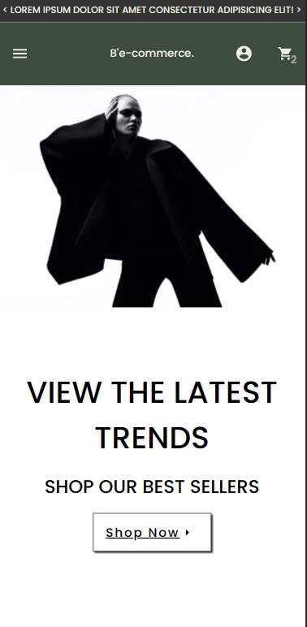

This is currently a front end only project is built with React.
 
I hard-coded half the design myself with some components encorporated from the MUI library.

I am currently learning back end and improving my testing skills and learning state management. This project is therefore, is still a work in progress and these new skills will be implemented accordingly. See below for a upcoming roadmap.

To get started use: yarn start
or visit: (live link coming soon).

Screenshots:

Desktop:

Mobile:

Front end design (completed | 27/12/2021)

Functionality of site, i.e., adding item to basket. (goal | 02/01/2021)

Implement the Etsy API to allow for real products and descriptions. (goal | 10/01/2021)

Implement tests with Enzyme and Jest (goal | 15/01/2021)

more to be added...